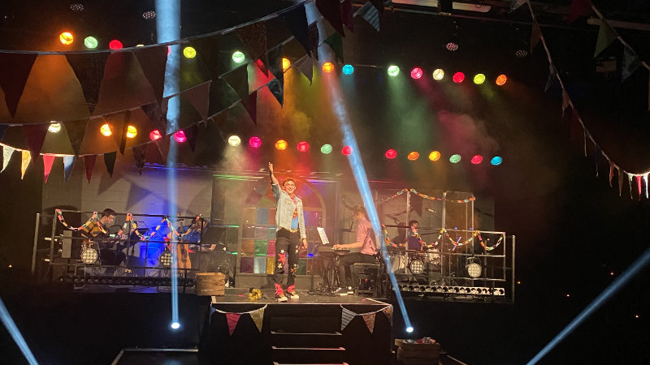
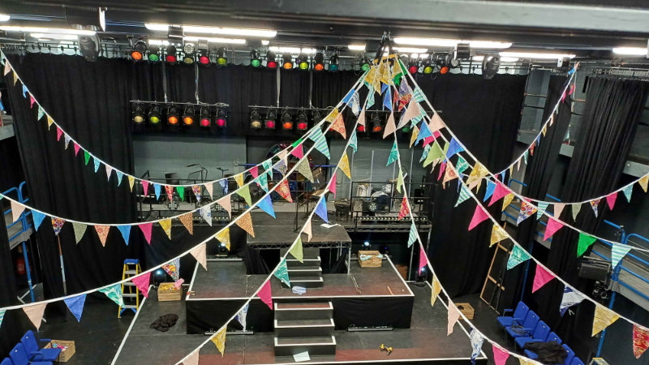
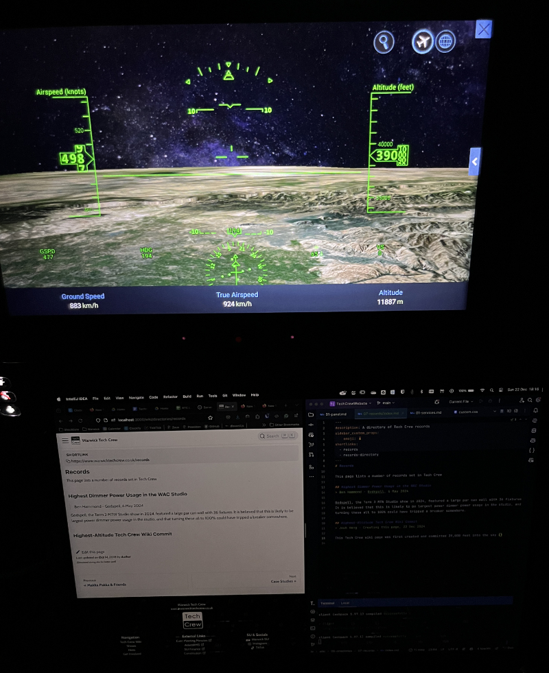

# Tech Crew Records

This page lists a number of records set in Tech Crew

## Highest Dimmer Power Usage in the WAC Studio

> Ben Hammond - Godspell, 6 May 2024

<figure>
    

    
    
    

    <figcaption>Ben's PAR can wall during Godspell.</figcaption>
</figure>

Godspell, the Term 3 MTW Studio show in 2024, featured a large PAR can wall with 36 fixtures. It is believed that this
is likely to be largest power dimmer power usage in the studio, and that turning these all to 100% could have tripped a
breaker somewhere.

## Highest-Altitude Tech Crew Wiki Commit

> Josh Heng - Creating this page, 22 Dec 2024

<figure>
    

    
    

    <figcaption>Josh creating the Tech Crew records page on the plane.</figcaption>
</figure>

This Tech Crew wiki page was first created and committed 39,000 feet (11,887m) into the sky on a Singapore Airlines
flight from London to Singapore. This flight featured free WiFi!

The second highest and second ever aircraft tech crew wiki commit was made on 27/07/25 on an Air India A350-900 flight
AI112 between heathrow to delhi on the way to Japan while the authors were hungrily waiting for free snacks and food.
The wifi is really slow but also free. Actually none of this was free we paid £760 for this wifi and food. Update: they
are serving food yipee I'm so hungry. our plane was delayed 2h because someone felt sick and had to be escorted off then
they had to rumage for that persons bag in the hold. Plane WiFi was available above 10,500ft isn't that crazy,
satellites or something. food review coming soon. Food review: it was so good woah there was chickpea potato lime
coriander side pot chopped up thing it was very flavour i love indian food they season things. i had to get halfway
through the chicken before i made the link between its flavour and the word cardamon because i eat flavour so rarely.
they had a chocolate raspberry dessert pot that danny said looked like a petri dish but tasted good. plane seat angry
birds review coming soon. 37,001ft. 

# Land Speed Record

> 16th Sep 2025

Highest GPS land speed Tech Crew wiki commit: 115 mph on the Autobahn 1 in Germany. 

