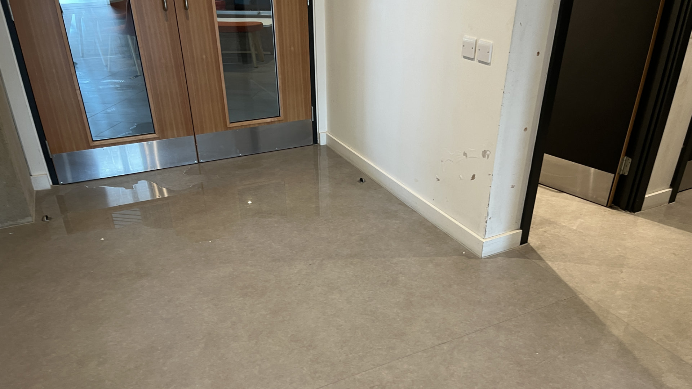

# University Showers

The University of Warwick has a number of showers available for use by students and staff. This is useful for events
such as the [Warwick Student Arts Festival](https://wsaf.org.uk) which can involve staying on campus overnight.

:::info
If you are doing a lot of tech (i.e. heavy lifting) and are staying on campus overnight, please make sure you actually
shower. Thanks in advance!
:::

[Estates maintain a map](https://warwick.ac.uk/about/campus-journey/mode-of-travel/cycling) of showers on campus along
with other cycling facilities, however this may not be fully up to
date. [Warwick's Campus Map](https://campus.warwick.ac.uk/)
also shows the location of showers within each building, but this may be harder to navigate/list.

Currently we do not know of any showers that are available 24/7 (i.e. after 10pm).

## [Faculty of Arts Building (FAB)](https://campus.warwick.ac.uk/search/623c8866421e6f5928c0c937?projectId=warwick)

The FAB contains an accessible shower between the theatre dressing rooms and four additional unisex showers on the
ground floor - more information can be found on their
[FAQ](https://warwick.ac.uk/fac/arts/news/fabuserguide?selectedLetter=t#toilets-and-showers).

This building is only open
[during the day (7am - 10pm)](https://warwick.ac.uk/fac/arts/news/fabuserguide?selectedLetter=o#opening-times).

### [FAB Accessible Theatre Shower](https://campus.warwick.ac.uk/search/623c8961421e6f5928c0fb8f?projectId=warwick)

The accessible shower is located in the theatre studio section of the FAB ground floor, on the left between the two
dressing rooms. Overall, this is quite a good shower with a large space and a place to hang clothes, however it is
difficult to change the shower's temperature and drainage is not great.

### [FAB Unisex Showers](https://campus.warwick.ac.uk/search/623c8961421e6f5928c0fb97?projectId=warwick)

<figure>

<figcaption>Drainage issue in the FAB unisex showers</figcaption>
</figure>

There are four unisex showers located on the ground floor of FAB however these are very small with few pegs to hang up
clothes. There is also very bad drainage in these showers, and due to not having a dedicated shower basin can lead to
water leaking out into the corridor (see above image).

## [Mathematical Sciences Building (MSB)](https://campus.warwick.ac.uk/search/623c8865421e6f5928c0c8e1?projectId=warwick)

<figure class="img-small">

</figure>

The MSB has a number of unisex showers available for use on
[floor 1](https://campus.warwick.ac.uk/search/623c8948421e6f5928c0f630?projectId=warwick) to
[5](https://campus.warwick.ac.uk/search/623c894b421e6f5928c0f6df?projectId=warwick). These are generally good showers -
they contain a shower basin so won't leak water everywhere, have a decent number of hooks, and have a good temperature
and pressure.

Note that these are only
accessible to maths/computer science students during the day (7am - 10pm), unless you have a staff card in those
departments. Outside of these hours, whilst it is possible to get into the MSB, there is no upstairs access.

## [Warwick Sports and Wellness Hub](https://campus.warwick.ac.uk/search/66475ac4d8dbf518cbed2fe0?projectId=warwick)

If you have a gym or swim membership at the Sports Hub, you can use the showers there.

## [Warwick Arts Centre](https://campus.warwick.ac.uk/search/623c885e421e6f5928c0c7cd?projectId=warwick)

The Warwick Arts Centre has many showers backstage, however unless working on a production in the Arts Centre this
should be avoided if possible.