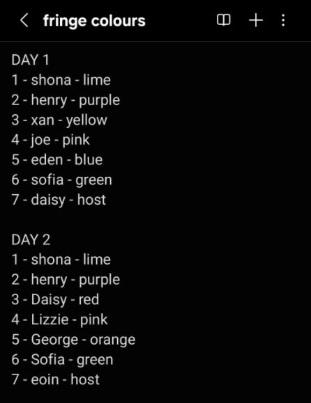
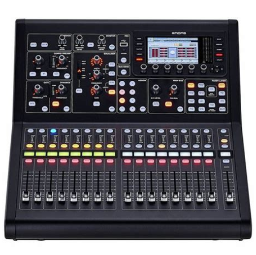
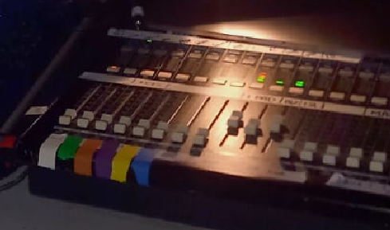
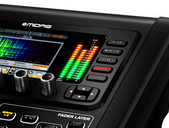

---
sidebar_custom_props:
  emoji: 🐒
description: Improv at Fringe!
---

# Sound @ Improv Fringe

:::warning

This is what worked for 2024. Things like the band setup and host mic setup may be different this year! The venue is
also different! In 2024 & 2023 we where up in the Big Yin, but in 2025 you're doonstairs, like was done in 2022! You
should ignore any advice in this page if a real person in the venue tells you something different, they are probably
right.

:::

## Day Plan

### Before get in

#### Night Before:

- Bring the batteries home from the venue.
- Put batteries on charge in the house next to your bed.

#### Before You Leave the House:

- Bring the batteries with you!

#### Before Get-In:

- Create a channel list on your phone notes app. The number is both their channel number on the sound desk, and the
  number of the mic pack you should to give them. For example, on the first day, I gave Joe mic pack number 4 and I
  coloured the 4th channel on the sound desk pink.

<figure class="img-small">
  
  <figcaption>Cast channel list for a day at fringe.</figcaption>
</figure>

#### While Waiting Outside the venue:

- Give the cast their headset mics. If its their first show you'll have to re-fit an unused headset and write their name
  on the box.
- Turn all the mic packs on.
- Hand out the mic packs to the correct people.
- Make sure the packs are connected and plugged in tightly to the mics.
- Give the host their handheld mic and turn it on (unless you're using a wired host mic).

:::info

Fully charged batteries in our new RM system will last 2-3+ hours, so keep an eye on battery levels but don't stress
about them if they're all 2 or 3 bars.

:::

### Get in

#### Part 1 (aim to do in about 5 mins):

- (Last year) the venue technician loaded our show file for us (check if they still do this!).
- Wire up the band pit as per your notes and pictures.
- Make sure the foldback monitors are in the correct position.
- Set the channel colours on the desk as per your notes.

#### Soundcheck (start as soon as you've done the above steps):

- Quickly soundcheck the band (just make sure you have signal showing up in the desk from each of the band members).
- Soundcheck cast mics (spend about 5 to 10 seconds doing each channel):
  1. Tell everyone to be quiet please.
  2. On the desk, select a cast mic channel and tell that cast member to sing.
  3. Adjust the gain knob until the metering is just peeking into the orange zone.
  4. At the same time, push the fader up to around 0 and you should hear the cast member clearly and loudly out the
     speaker.
  5. Mute that channel and move on to the next person.
- Ask the cast to run an ensemble opening, ask the host to announce the opening with their mic so the host gets practice
  too (and so you can get their level right).

### Show starts!

#### During the Show

- Remember that the host comes back on halfway through, turn their mic on again for this.

#### Get-Out:

- Move the monitors out of the way of the marketing picture.
- Unplug the band (if you mute their channels before unplugging them you wont get popping sounds when you unplug them).
- Collect cast radio mics and pack them away (get people to help you with this – e.g. the LX person and production
  team).
- Take the battery box home.

#### At Home:

- Recharge the batteries overnight.

## Sound desk

In 2025, you're using the Midas M32R. The M32 has little screens above each channel, and you can set the colour of these
screens in the desk's setup so that they correspond to the t-shirt colour of the performer with that mic pack number.

<figure>
  

</figure>

:::tip

**To set the colour of a channel on the M32:**  
Select the channel → Click the **"setup"** button → Use the arrow buttons  
to go to the **"scribble strip"** tab → Use the knob under the screen below the **"colour"** label  
to change the channel colour to that performer's t-shirt colour.

:::

:::lore

In 2024/2023, we were using the older more analogue-looking Yamaha LS9 sound desk, so ended up using LX tape to mark
which cast member was on which channel (because the LS9 doesn't have screens for channel labels).

<figure>
  

</figure>

:::

## Advice

- Make friends with the venue techs! They know the venue and will be able to fix any pre-show issues if they like you.
- Go through soundcheck quickly so you can practice a couple ensemble openings. Soundcheck is where you set the gain,
  you should only spend about 5-10 seconds on each channel setting the gain and getting the metering in the right place.
  Soundcheck is just to get all the cast and band audible, once you've done this you can ask them to run an ensemble
  opening so you can practice. You don't need to get the gain perfect in soundcheck because you can always adjust it
  later during the show.

### What to pay attention to during your handover

- Take pictures of the band set up!. Have pictures of where each cable goes in and out of the DI boxes.
- Understand what to do in soundcheck. Know what the metering is (see image), its the bars that show how loud the
  selected channel is. In soundcheck watch how we adjust the gain until the selected channel is loud enough to fill up
  the metering bars all the way up to where it stars to go orange.

<figure class="img-small">
  
  <figcaption>
    Metering bars on the M32. When a channel is selected, this will show how loud the channel is, it should fill the
    green section without going too far in the orange (but like, you should ignore that advice and use your ears).
  </figcaption>
</figure>

### Other Advice

:::warning

**You can probably ignore this warning its just interesting** If the show before us is using radio mics too, turning
ours on _may_ interfere with their frequencies and their show will start to sound crackly. Fortunately, Gilded ballon
tech spec says: "Gilded Production Will coordinate radio mic frequencies across their sites" so it should be fine ?!

:::lore

RF interference was a problem we faced in 2024! However the previous show kept overrunning and cutting into our get in
time so I started hoping the RF issues would encourage them to speed up. I would also (completely guess) that because
our new RM system is encrypted this might no longer be an issue, also we have changed frequencies since the 2024 system.
Who knows! Sound isn't real!

:::
