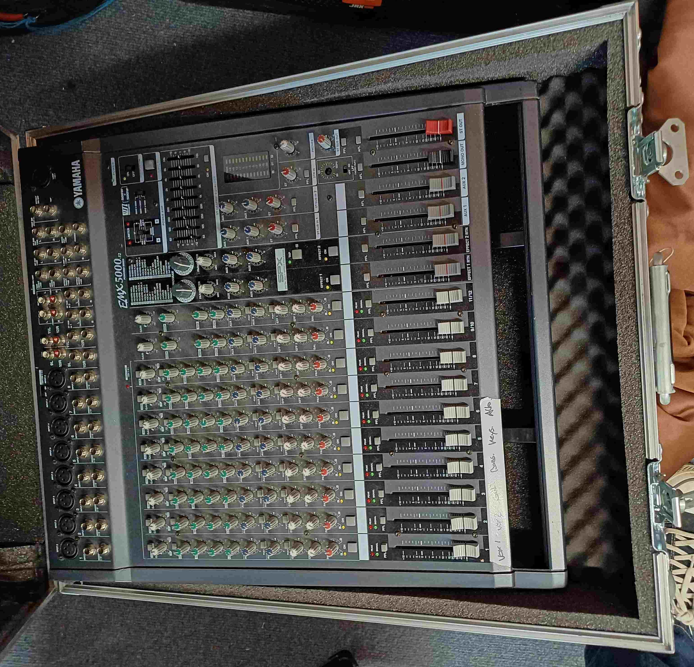
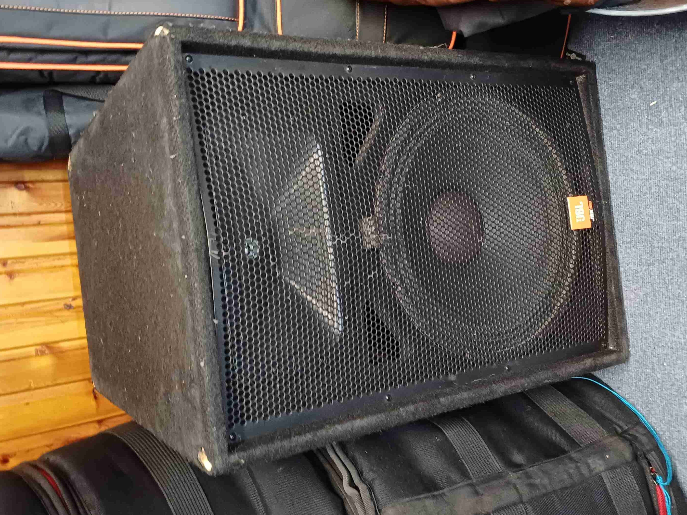

---
sidebar_custom_props:
  emoji: 🎤
description: Improvised Musical theatre shows in Avon Drama studio
---

# MTW Improv in Avon

## Timeline

Tech for an Improv show is practically a full day commitment. For this page, we assume the show is in the Avon Drama Studio and has doors open at 19:15 for show up at 19:30.
The main thing that can go wrong is forgetting equipment (namely, the batteries, or.. literally all the powercon) so keep checking against equipment lists + update the 
equipment lists with what gets forgotten! (there's always something).

| Time           | Duration | Activity                                     |
|----------------|----------|----------------------------------------------|
| 16:30          | -        | Car arrives at WAC stage door                |
| 16:30 -> 16:40 | 10m      | Load car                                     |
| 16:40 -> 17:00 | 20m      | Walk remaining cases from WAC to Avon        |
| 17:00 -> 18:30 | 1.5h     | Setup Equipment                              |
| 18:30 -> 18:40 | 10m      | Mic up                                       |
| 18:40 -> 19:00 | 20m      | Soundcheck + 2x practice ensemble opening    |
| 19:00 -> 19:15 | 15m      | Cast to dressing room, preset                |
| 19:15 -> 19:30 | 15m      | Doors open                                   |
| 19:30          | 1h       | Show UP                                      |
| 20:30          | -        | Pack down                                    |

## Sound

Below documents the sound setup used for 3 MTW Improv shows in [Avon drama studio](/wiki/04-spaces/03-avon.md) in the 23/24 academic year. 
It has now been updated for the 24/25 setup with the new radio mic system.

### PA 

For main PA, we used two LVX on their stands at the front, placed out of the way of: the performance space, the whiteboard, and the band.

### Band pit

The stagebox goes in the center of the pit, connecting to the SQ5 via the long ethercon. Remember to put the ethercon in the SLink port of the stagebox,
and not in the expander port! I use a 4 way xlr loom for neatness to connect the stagebox to the DI's. Taking the main DI out into the stagebox through the
loom, and the through/link DI output into the MTW mixer for their band monitoring. Its important to angle the band monitor in such a way that its pointing 
away from the audience and away from the performance space.

### Band Monitoring 

To provide the band monitoring, we used the [MTW active sound desk](https://usa.yamaha.com/news_events/2002/20020117_yamaha-emx5000-series-mixers-just-add-speakers_us.html) to drive their passive speaker stored in the avon cupboard.
These just need 13A power, as the mixer has a built-in amp that can drive the speaker!
To send things out the band monitor, first route them out the SQ5 stagebox, and provide them as inputs to the MTW mixer.
Make a mix with all the vocal channels post fade, then make a second mix with all the band channels pre fade.
Send these mixes down the ethercon cable to 2 outputs on stagebox in the band pit.
This allows the band control over making the vocals the right level, which eliminates the biggest complaint from the band i.e. not being able to hear cast.

    
    

Band will normally be keys, bass, guitar, drums. Adding more band (which has happened) makes things much more difficult to mix!  

### Equipment list

| Quantity | Item                                                | Usage / Notes                                      |
|----------|-----------------------------------------------------|----------------------------------------------------|
| 2x       | Mono DI box + 5m XLR + 1x Jack                     | Guitar + bass, put the DI link into MTW mixer if they don’t have amps |
| 1x       | Condenser mic + stand / VXL-R + MKE2               | Strings (cursed)                                  |
| 1x       | Stereo DI box + Short XLR + 2x Jacks               | Keys                                              |
| 2x       | LVX + speaker stands + 13A-IEC + 13A extension + 15m XLR | PA                                          |
| 1x       | RM receivers + battery box + 2x 13A-IEC + long 4-way 13A extension |                                   |
| 2x       | 4-way XLR loom                                     | For RM->SQ5, should be in RM case                 |
| 1x       | 4-way XLR loom                                     | For stagebox -> DI’s                              |
| 1x       | RM transmitter case                                |                                                   |
| 6x       | Headset mic case + adapters                        | Cast mics                                         |
| 1x       | Host mic + 20m XLR                                 |                                                   |
| 1x       | SQ5 + Stagebox + Ethercon + Headphones             |                                                   |
| -        | XLR, 13A splitter, 13A extension, Jack cable       | Just bring extra |

## Lighting (by Echo Vaughan)
Below documents the **lighting** setup in [Avon drama studio](/wiki/04-spaces/03-avon.md) throughout the 23/24 Academic year.
To ensure that the lights don't snap when changing colour, you must create a playback fader to adjust the fade speed because it looks better. Please don't ask me how to do this because I don't know.

### Backlights
Right against the back wall, there are 4 cobs (clamps removed) pointing directly upwards and evenly spaced apart which lights the wall. This allows fun colours to be displayed behind the cast, making the lighting more interesting than just having facelights.

### Facelights
The other 2 cobs are champed on to the lighting stands on either side of the main doors to be used as facelights. Power and DMX need to be taped together and run over the door frame so they don't become a trip hazard.

### Equipment list

| Equipment | Cables | Notes |
|-----------|-------|-------|
|**6 Prolights StudioCob FCs**| Powercon, Powercon-13A and DMX including the 20m cable  | 20m cable needed to reach back of Avon from tech area |
| **Zero 88 FLX** | Powercon true 1-13A | Cable in flx flight case |
| **Lighting Stands** | 13A extension leads | Make sure you have the t bars to go on top of the stands|
